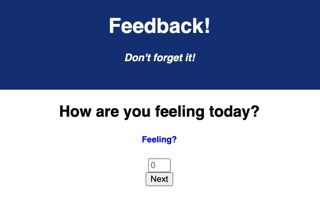

# Weekend-Redux-Loop

## Description

This application is a student form that lets the user fill out how they are feeling, how they are comprehending the material, how supported they feel and any comments they may have

## Screenshots

## Built With

## Getting Started

Fork and clone repo onto your computer

### Installation

Create your database and tables using the provided data.sql file.
Run npm install
npm run server
npm run client

## Contact Me

  
